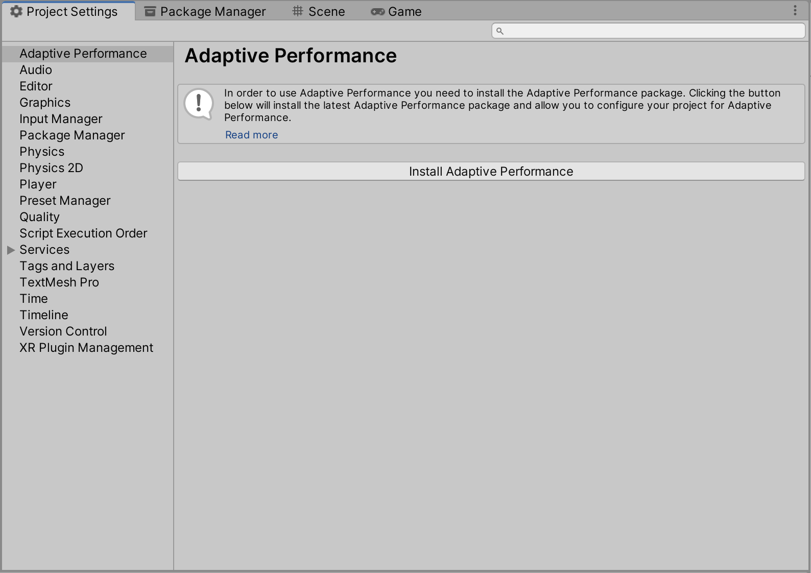
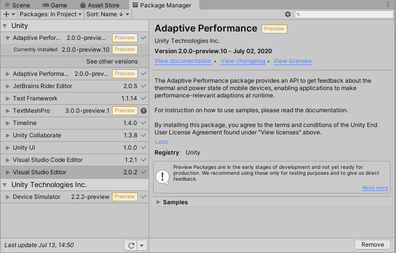

**_Adaptive Performance Installation Guide_**

# Installing Adaptive Performance

Adaptive Performance uses **Adaptive Performance Provider Management** to help streamline **Adaptive Performance provider** lifecycle management and provides you with build time UI through the Unity **Unified Settings** system.

## Installation 2.0.0 Preview

Use the [Unity Package Manager](https://docs.unity3d.com/Packages/com.unity.package-manager-ui@latest/index.html) to install the **Adaptive Performance Samsung Android** package, which includes the Samsung Android subsystem for Adaptive Performance. Unity automatically installs the Adaptive Performance package as a dependency of the Adaptive Performance Samsung Android package.

### Quick Setup Guide

* Install **Android Support** for Unity. Unity needs Android Support to build to your Samsung device.
* **Switch Platform** to Android in the **Build Settings** window.
* (During 2.0.0-preview) Use the Unity Package Manager and install the **Adaptive Performance Samsung Android** package which includes the subsystem. The Unity Package Manager then automatically installs the Adaptive Performance package as a dependency for you as well.
* Install and activate the **Adaptive Performance Samsung Android** provider in Adaptive Performance Settings.

## Installation

For a released version of the package in production, referencing the package is no different than any other released package.
There are several ways to install Adaptive Performance. Select one of the following options to install Adaptive Performance:

- __[Project Settings](#project-ettings)__
- __[Unity Package Manager](#unity-package-manager)__
- __[Manual Installation](#manual-installation)__

### Project Settings

Use Adaptive Performance Settings in the Project Settings __Edit > Project Settings > Adaptive Performance__ to install the latest version of Adaptive Performance.



### Unity Package Manager

Use the [Unity Package Manager](https://docs.unity3d.com/Packages/com.unity.package-manager-ui@latest/index.html) to install the **Adaptive Performance** package.



### Manual Installation

Adaptive Performance can also be installed manually. You only need to add a reference to Adaptive Performance in your Project's `Packages/manifest.json` file. There are two ways you can reference a specific version of the Adaptive Performance package, depending on how you use it.

#### Using a production version of the package

You can point the Package Manager at a public available version. To do this manually you can add it to `manifest.json` like this:

```json
    "dependencies": {
        //...
        "com.unity.adaptiveperformance":"<full version number>"
    }
```

#### Using a local clone of the package

If you want to use a cloned version of the package directly, you can point the Package Manager at a local folder as the location from which to get the package from.

```json
    "dependencies": {
        //...
        "com.unity.adaptiveperformance":"file:path/to/package/root"
    }
```

**Note:** The root of the package folder isn't necessarily the root of the cloned repository. The root of the package folder is the folder where the `package.json` file is located.

## Provider Installation

Adaptive Performance only works in combination with data provider subsystems. Those provider can be installed and enabled per platform in the Adaptive Performance Settings __Edit > Project Settings > Adaptive Performance__.


To use Adaptive Performance, you must have at least one subsystem installed and activated. This version of Adaptive Performance supports the following subsystems:

* [Samsung (Android)](https://docs.unity3d.com/Packages/com.unity.adaptiveperformance.samsung.android@latest/index.html)
* [Simulator (Desktop)](simulator.md)

### Using the Adaptive Performance Provider Management system

There are two target audiences for the Adaptive Performance Provider Management system: the end user and the subsystem provider developer. You can find documentation for both audiences here:

* [End-user](./user-guide.md)
* [Provider](./provider.md)

## Technical details

### Requirements

This version of Adaptive Performance is compatible with the following versions of the Unity Editor:

* 2019 LTS and later (2020.2 and later recommended)

### Known limitations

None.
