# Using Adaptive Performance samples

Adaptive Performance ships with samples to help you integrate all package functionality into your Project.

When you install the Adaptive Performance package, Unity automatically downloads its associated samples. Import these samples into your Project to see example uses of the Adaptive Performance APIs you can use as a starting point, or to test and verify results on your device.

While running, each sample will log information about the current state and any decisions being made in the system. The [Android Logcat package](https://docs.unity3d.com/Packages/com.unity.mobile.android-logcat@latest) is an excellent way to monitor current activity when using Adaptive Performance on Android. Each sample also defines its own end conditions. When those conditions are met, the application will exit. You can find all messages, state changes, temperatures, etc. in the log.

## Installation

Install Adaptive Performance samples from the **Package Manager** window. Some of the samples require Universal Render Pipeline to work while other work with any renderpipeline. The following samples are available for any render pipeline:

- [Sample Environment](#sample-environment)
- [Thermal Sample](#thermal-sample)
- [Bottleneck Sample](#bottleneck-sample)
- [Boost Sample](#boost-sample)
- [VRR Sample](#vrr-sample)
- [Automatic Performance Control Sample](#automatic-performance-control-sample)
- [Adaptive Framerate Sample](#adaptive-framerate-sample)
- [Adaptive LOD Sample](#adaptive-lod-sample)
- [Adaptive Resolution Sample](#adaptive-resolution-sample)
- [Adaptive View Distance Sample](#adaptive-view-distance-sample)
- [Scaler Profiles Sample](#scaler-profiles-sample)

The following samples require Universal Render Pipeline:

- [Adaptive Batching Sample](#adaptive-batching-sample)
- [Adaptive LUT Sample](#adaptive-lut-sample)
- [Adaptive MSAA Sample](#adaptive-msaa-sample)
- [Adaptive Shadow Sample](#adaptive-shadow-sample)
- [Adaptive Sorting Sample](#adaptive-sorting-sample)
- [Adaptive Transparency Sample](#adaptive-transparency-sample)

## Sample Environment
The sample environment is required for most of the samples, because the samples share the same assets. You should install the sample environment before installing any other samples to have the necessary base structure available.

## Thermal Sample
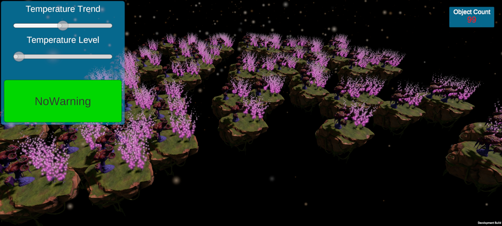

This sample demonstrates how to register and respond to thermal state change events from the Adaptive Performance API. The thermal states can be difficult to trigger when a device is just sitting on a desk, because devices are designed to prevent overheating. You might need to set the device on something warm, keep it in your hands, or find another way to prevent heat loss on the device to see the effects.

This sample is heavy on GPU usage to produce enough heat and then be able to cool down quickly afterward to activate the different warning levels. These levels are:

- Nominal - The device is cool enough to operate at full CPU speed.
- Throttling Imminent - The device is heating up and trending toward the need to throttle the CPU and GPU soon to prevent overheating.
- Throttling - The device has overheated and the CPU and GPU speeds have been throttled until the temperate drops down to a safe level.

The sample also has sliders to indicate the current temperature trend and level. When the device reaches a throttling state, the sample will stop drawing most objects to begin a fast cool off period until it is trending back toward a nominal state.

## Bottleneck Sample
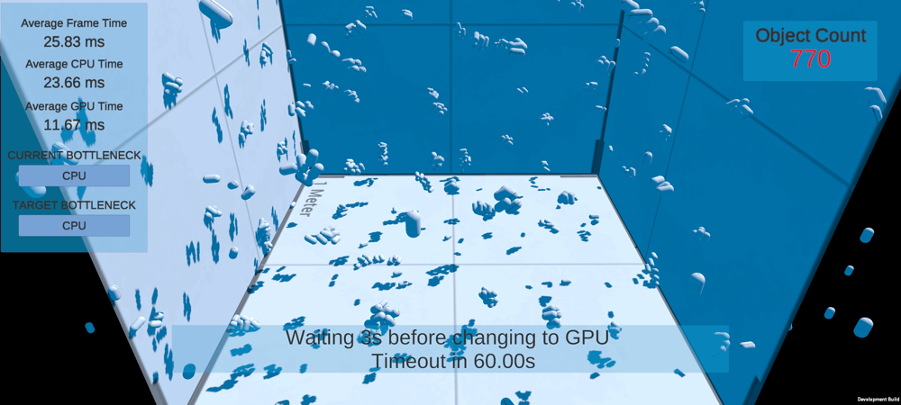

This sample demonstrates the use of the bottleneck detection API. Adaptive Performance can detect three bottleneck types: CPU, GPU, and target framerate.

The sample runs in a rotation of the three possible states:

- Targeting CPU Bottleneck - Disable GPU heavy tasks, enable CPU heavy tasks.
- Targeting GPU Bottleneck - Disable CPU heavy tasks, enable GPU heavy tasks.
- Targeting Framerate - Disable CPU and GPU heavy tasks.

While the sample runs, information about the bottleneck state is stored in a list of Marker structs. Each Marker contains the time, a label, and the number of objects that were active at that time. When the sample has finished running, all of the Markers are written to the log.

If the currently targeted bottleneck has been stable for at least 5 seconds, the system saves a Marker with the status information. After waiting 3 seconds to let the device settle, more information is saved, then test switches to the next bottleneck.

### Options

The BottleneckControl Prefab in the Bottleneck scene enables you to configure several attributes of how the test operates:

|**Option**|**Description**|
|:---|:---|
|CPU and GPU loaders|These are Prefabs that will be spawned until the target bottleneck is reached.|
|Time Out|How long (in seconds) to wait for each bottleneck to be reached before switching to the next one.|
|Wait Time Before Switch|How many seconds before starting the next part of the test.|
|Wait Time After Target Reached|How long to wait (in seconds) after meeting the target bottleneck.|
|State Change Iterations|How many times the sample iterates through each bottleneck type.|

## Boost Sample
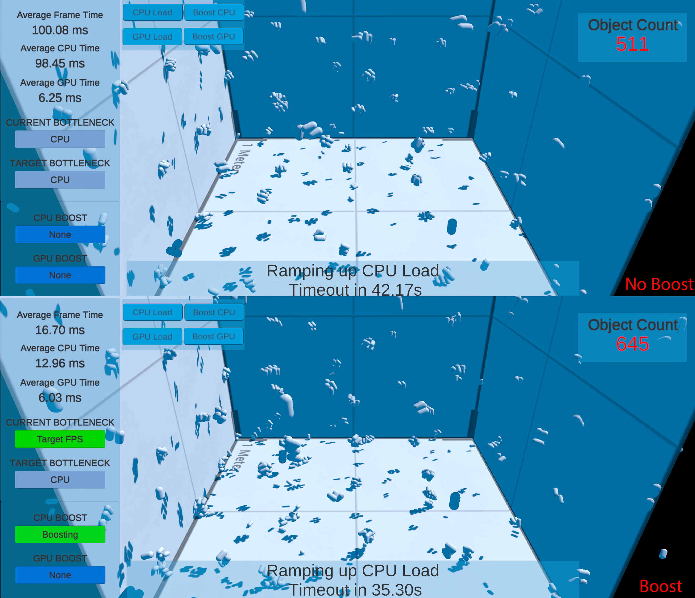

This sample demonstrates the use of the CPU and GPU boost API. Adaptive Performance can request a CPU or GPU boost which changes the minimum and maximum frequency of the CPU or GPU to provide more resources to the CPU and GPU.

The sample has buttons to activate the CPU and GPU boosts and simulate high CPU or GPU load.

The scene spawns bees. The log prints the time, and the number of bees spawned.

When you simulate a high load, you can see the CPU time or GPU frame time increase. When you activate boost mode, you can see the CPU or GPU frame time reduce for 15 seconds.

Using boost mode with CPU load generally increases the number of bees spawned.

## Cluster Info Sample

This sample demonstrates the use of the Cluster Info feature.

CPU cores come in different sizes and configurations on heterogeneous systems. This sample prints the number of big, medium and little cores to the log. It also demonstrates how to check if a feature, such as Cluster Info, is available. The sample prints *Not Supported* in red to the screen if the API is not available or not supported.

## VRR Sample
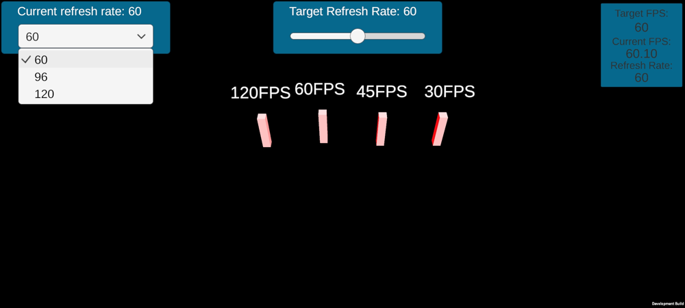

Some devices are capable of changing the screen's refresh rate through device settings or at runtime with Adaptive Performance. This sample shows some moving objects with a dropdown menu to change the refresh rate so you can see how the refresh rate affects the smoothness of motion on the screen. The slider lets you adjust the target framerate.

At lower refresh rates, the motion of the objects might appear a little choppy. It will get smoother as you increase the screen's refresh rate.

At the time of writing, the only device to support Variable Refresh Rate is the Samsung S20+ with GameSDK 3.2 or later.

**Note** This demo requires the [Samsung (Android)](https://docs.unity3d.com/Packages/com.unity.adaptiveperformance.samsung.android@latest/index.html) provider to be installed.

## Automatic Performance Control Sample
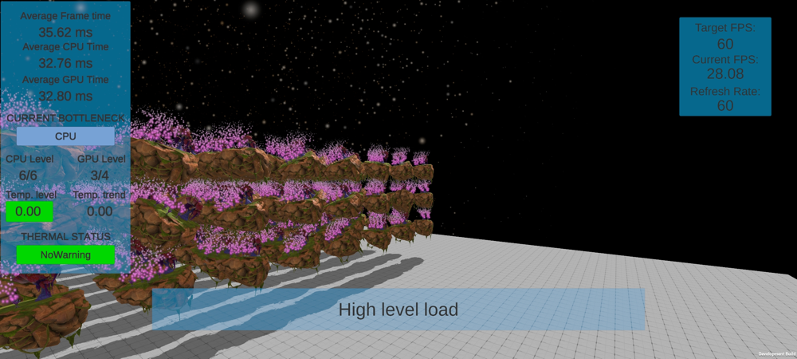

The Automatic Performance Control sample shows how the Automatic Performance Control features of Adaptive Performance works, using two different prefabs that have a medium and high CPU load respectively. Both scenes target 60 FPS and attempt to keep the frame rate stable. If the device reports that throttling is imminent, the sample drops the framerate to 45 and Adaptive Performance automatically reduces the load on the device until it cools down and stops throttling.

The AutomaticPerformanceControl scene has an AutoPerfControl Prefab that allows you to modify some parameters of the test:

|**Option**|**Description**|
|:---|:---|
|High Level, Mid Level and No Load|References to Prefabs which are used for each test stage.|
|Test Timeout|Time in seconds for the test to run.|
|Auto Control Mode|You can disable the Adaptive Performance auto mode to see what effect the system has on thermal and bottleneck performance.|
|State Text|Reference to the UI Text element to display status.|
|Logging Active|A toggle to enable or disable logging.|
|Logging Frequency|The interval between writing messages to the log, in seconds.|

The TestSequence component has some additional options for configuring how the tests run:

|**Option**|**Description**|
|:---|:---|
|Auto Mode|The test will loop through the defined sequence until the device reaches the Throttling Imminent thermal state  at which point target FPS is set to 45. The timeout is defined in the Auto Perf Control component.|
|Test Sequence|The order in which test levels should load, and how long they should run, in seconds.|

## Adaptive Framerate Sample
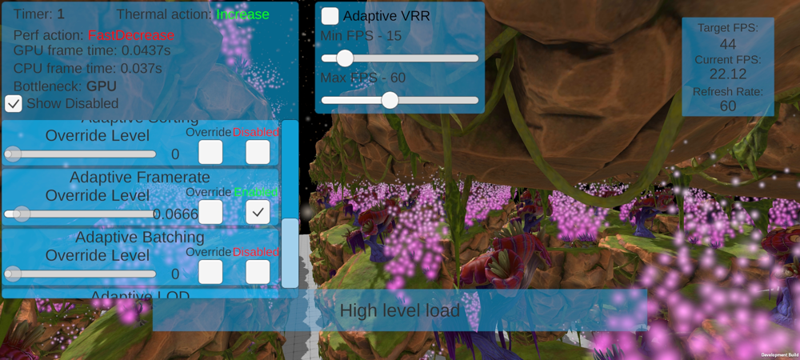

The Adaptive Framerate sample shows how the framerate can be adjusted dynamically at runtime.

This feature uses the Indexer system to make decisions on when and how much to increase or decrease the framerate to maintain performance and thermal stability.

The sample uses the same content as the Auto Performance Control sample. It switches between high and medium CPU load while using no load for 15 seconds in-between each load set to allow the framerate to come back up.

### Options
The Adaptive Framerate sample uses the Scaler Visualization Prefab and enables you to see the status of the Scalers. It lets you modify the status for easier testing:

- Enable or disable the scaler
- Override to change the level via the slider in the UI instead of relying on the Indexer to control the level (used for testing)

To adapt framerate automatically, use the **Adaptive Framerate** and **Adaptive Variable Refresh Rate** Scalers.

By default, no Scaler is enabled and you need to enable **Adaptive Framerate** and/or **Adaptive Variable Refresh Rate**. Each of those Scalers has a different purpose.

You can switch between **Adaptive Framerate** and **Adaptive Variable Refresh Rate** using the checkbox at the top center of the sample. Additionally you can use the sliders underneath the checkbox to limit the framerate range that the scaler will adjust to.

In the sample scene you will be able to see Target FPS decreasing during the CPU and GPU heavy portions and rising back up when the load is decreased.

|**Scaler**|**Description**|
|:---|:---|
|Adaptive Framerate| Uses Application.TargetFramerate for managing the framerate between minimum and maximum framerate.|
|Adaptive Variable Refresh Rate| Uses VRR on supported devices to set VRR close to the achievable framerate defined between minimum and maximum framerate of the Adaptive Framerate settings. Adaptive VRR is based on Adaptive Framerate and will change the Application.TargetFramerate to the maximum framerate. |

Both scalers share the same setting. Adaptive Framerate settings are available in the Adaptive Performance settings. Adaptive VRR is using the same base settings as Adaptive Framerate and if you change them for Adaptive Framerate it also changes them for adaptive VRR. We recommend to use Adaptive VRR always in combination with Adaptive Framerate and use the same settings. To change Adaptive VRR settings, you can either change the Adaptive Framerate settings or use C# API shown in `AdaptiveFrameRateSettings.cs`.

**Note** This demo requires the [Samsung (Android)](https://docs.unity3d.com/Packages/com.unity.adaptiveperformance.samsung.android@latest/index.html) provider to be installed if you want to use Adaptive VRR.

## Adaptive Resolution Sample
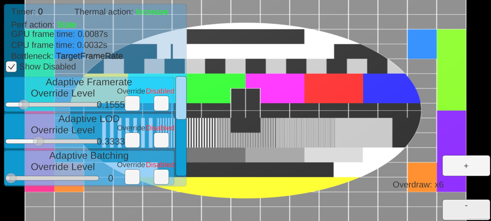

The Adaptive Resolution sample shows how the resolution can be adjusted dynamically at runtime.

This feature uses the Indexer system to make decisions on when and how much to increase or decrease the resolution to maintain performance and thermal stability.

Adaptive Resolution uses [Dynamic Resolution](https://docs.unity3d.com/Manual/DynamicResolution.html) and is only supported on Vulkan on any Render Pipeline. If you do not use Vulkan and use Universal Render Pipeline it will fallback and use the Render Scale.

In the sample you can see that as the device heats up and the Thermal action is **Decrease** the resolution of the image on screen will decrease and become less clear and sharp.

The overdraw control allows you to render multiple instances of the image on top of each other to increase the amount of GPU work and warm up the device faster.

### Options
The Adaptive Resolution sample uses the Scaler Visualization Prefab and enables you to see the status of the Scalers. It lets you modify the status for easier testing:

- Enable or disable the scaler
- Override to change the level via the slider in the UI instead of relying on the Indexer to control the level (used for testing)

## Adaptive LOD Sample
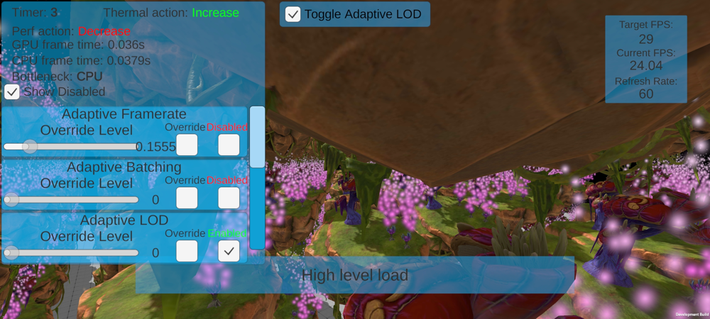

The Adaptive LOD sample shows how the lod bias can be adjusted dynamically at runtime.

This feature uses the Indexer system to make decisions on when and how much to increase or decrease the lod bias to maintain performance and thermal stability.

The sample uses the same content as the Auto Performance Control sample. It switches between high and medium CPU load while using no load for 15 seconds in-between each load set to allow the framerate to come back up.

### Options
The Adaptive LOD sample uses the Scaler Visualization Prefab and enables you to see the status of the Scalers. It lets you modify the status for easier testing:

- Enable or disable the scaler
- Override to change the level via the slider in the UI instead of relying on the Indexer to control the level (used for testing)

## Adaptive Batching Sample
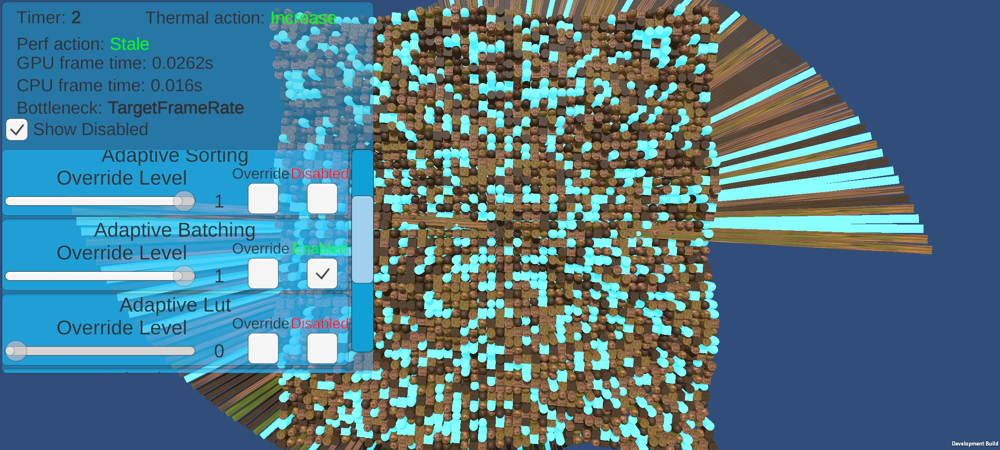

**Note:** You need to use the Universal Render Pipeline to see effects for this sample. Please see the [Universal Render Pipeline](#universal-render-pipeline) section for details.

The Adaptive Batching sample shows how batching can be adjusted dynamically at runtime.

This feature uses the Indexer system to make decisions on when and how to change batching to maintain performance and thermal stability.

Changes are not visible on-screen for this demo, please use a graphics performance analyzer to see the differences.

### Options
The Adaptive batching sample uses the Scaler Visualization Prefab and enables you to see the status of the Scalers. It lets you modify the status for easier testing:

- Enable or disable the scaler
- Override to change the level via the slider in the UI instead of relying on the Indexer to control the level (used for testing)

## Adaptive LUT Sample
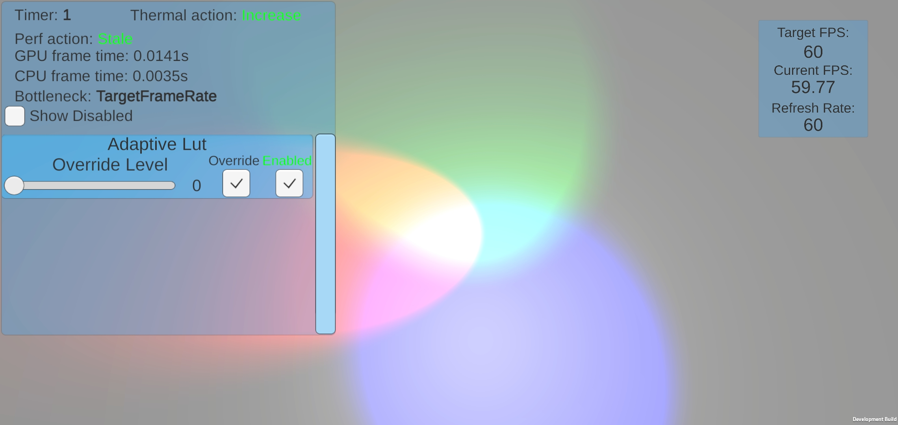

**Note:** You need to use the Universal Render Pipeline to see effects for this sample. Please see the [Universal Render Pipeline](#universal-render-pipeline) section for details.

The Adaptive LUT sample shows how the LUT size can be adjusted dynamically at runtime.

This feature uses the Indexer system to make decisions on when and how much to increase or decrease the LUT to maintain performance and thermal stability.

The sample shows color grading quality change when LUT size is adjusted. With smaller LUT size less graphics memory is consumed, but the color gradient transitions quality is reduced. This scaller work only with internal LUT generated from color grading effects. This scaler is not suitable to use with External LUT texture supplied to "Color Lookup" post processing effect.

### Options
The Adaptive LUT sample uses the Scaler Visualization Prefab and enables you to see the status of the Scalers. It lets you modify the status for easier testing:

- Enable or disable the scaler
- Override to change the level via the slider in the UI instead of relying on the Indexer to control the level (used for testing)

## Adaptive MSAA Sample
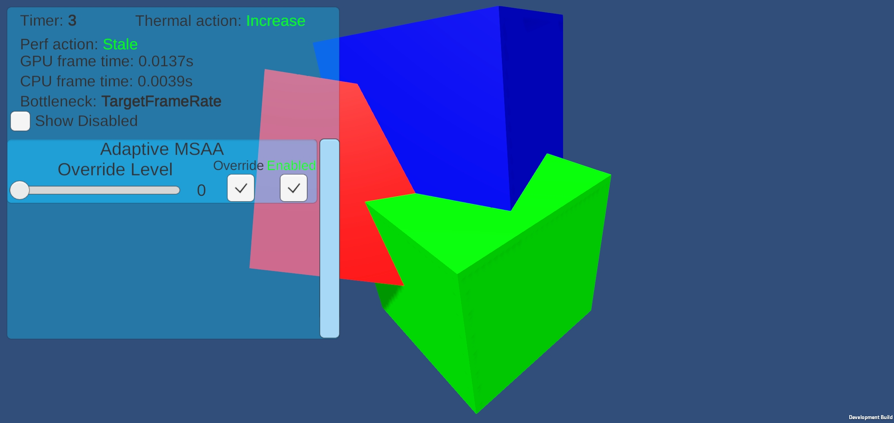

**Note:** You need to use the Universal Render Pipeline to see effects for this sample. Please see the [Universal Render Pipeline](#universal-render-pipeline) section for details.

The Adaptive MSAA sample shows how MSAA can be adjusted dynamically at runtime.

This feature uses the Indexer system to make decisions on when and how much to increase or decrease MSAA to maintain performance and thermal stability.

The scaler affects only camera's post processing subpixel morphological Anti-aliasing (SMAA) quality level.

### Options
The Adaptive MSAA sample uses the Scaler Visualization Prefab and enables you to see the status of the Scalers. It lets you modify the status for easier testing:

- Enable or disable the scaler
- Override to change the level via the slider in the UI instead of relying on the Indexer to control the level (used for testing)

## Adaptive Shadow Sample
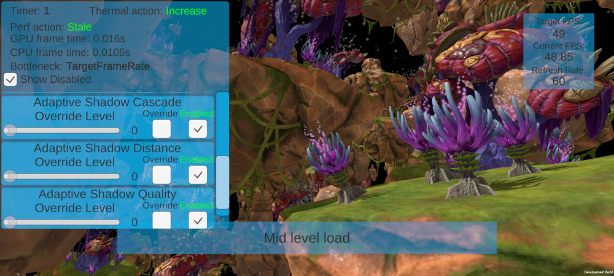

**Note:** You need to use the Universal Render Pipeline to see effects for this sample. Please see the [Universal Render Pipeline](#universal-render-pipeline) section for details.

The Adaptive Shadow sample shows how Shadow Distance, Shadow Cascades, Shadow Resolution and Shadow Distance can be adjusted dynamically at runtime.

This feature uses the Indexer system to make decisions on when and how much to increase or decrease the different shadow features to maintain performance and thermal stability.

The sample uses the same content as the Auto Performance Control sample. It switches between high and medium CPU load while using no load for 15 seconds in-between each load set to allow the framerate to come back up.

In the sample you should see the resolution of and distance at which shadows are rendering based upon the CPU and GPU load.

### Options
The Adaptive Shadow sample uses the Scaler Visualization Prefab and enables you to see the status of the Scalers. It lets you modify the status for easier testing:

- Enable or disable the scaler
- Override to change the level via the slider in the UI instead of relying on the Indexer to control the level (used for testing)

## Adaptive Sorting Sample
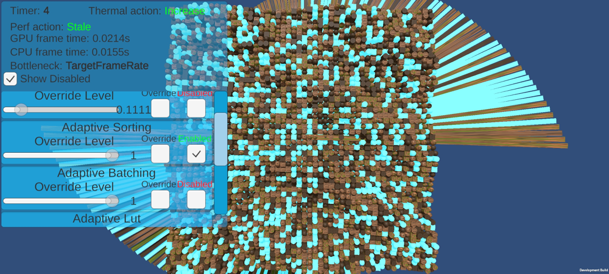

**Note:** You need to use the Universal Render Pipeline to see effects for this sample. Please see the [Universal Render Pipeline](#universal-render-pipeline) section for details.

The Adaptive Sorting sample shows how sorting can be used dynamically at runtime.

This feature uses the Indexer system to make decisions on when to change sorting to maintain performance and thermal stability.

### Options
The Adaptive Sorting sample uses the Scaler Visualization Prefab and enables you to see the status of the Scalers. It lets you modify the status for easier testing:

- Enable or disable the scaler
- Override to change the level via the slider in the UI instead of relying on the Indexer to control the level (used for testing)

Changes are not visible on-screen for this demo, please use a graphics performance analyzer to see the differences. In the Editor Stats you can see a change in SetPass calls.

## Adaptive Transparency Sample
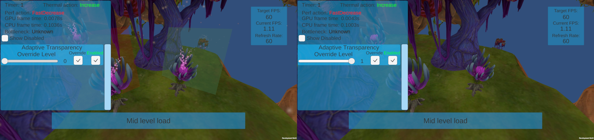

**Note:** You need to use the Universal Render Pipeline to see effects for this sample. Please see the [Universal Render Pipeline](#universal-render-pipeline) section for details.

The Adaptive Transparency sample shows how all transparent objects rendering can be disabled.

This feature uses the Indexer system to make decisions on when to disable transparent objects rendering to maintain performance and thermal stability.

### Options
The Adaptive Transparency sample uses the Scaler Visualization Prefab and enables you to see the status of the Scalers. It lets you modify the status for easier testing:

- Enable or disable the scaler
- Override to change the level via the slider in the UI instead of relying on the Indexer to control the level (used for testing)

## Adaptive View Distance Sample
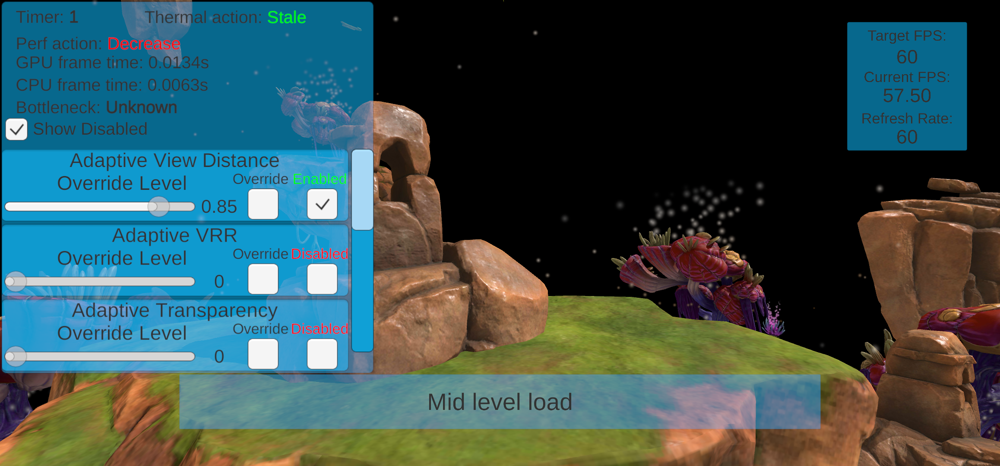

The Adaptive View Distance sample shows how you can change the view distance of the [main camera](https://docs.unity3d.com/ScriptReference/Camera-main.html). To use the scaler your main camera needs to be tagged with the tag *MainCamera*.

This feature uses the Indexer system to make decisions on when reduce the view distance to maintain performance and thermal stability.

### Options
The Adaptive View Distance sample uses the Scaler Visualization Prefab and enables you to see the status of the Scalers. It lets you modify the status for easier testing:

- Enable or disable the scaler
- Override to change the level via the slider in the UI instead of relying on the Indexer to control the level (used for testing)

## Scaler Profiles Sample
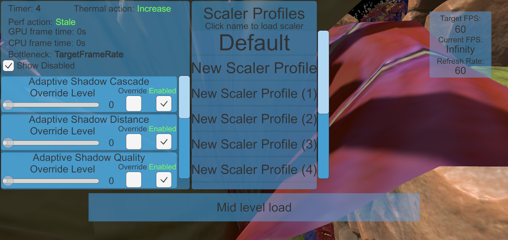

The Scaler Profiles Sample shows how you can use different scaler profiles to easily change scalers at runtime using the scaler profiles APIs.

This demo only works if you add more than the default scaler profile. You can add different scaler profiles in the Adaptive Performance settings.

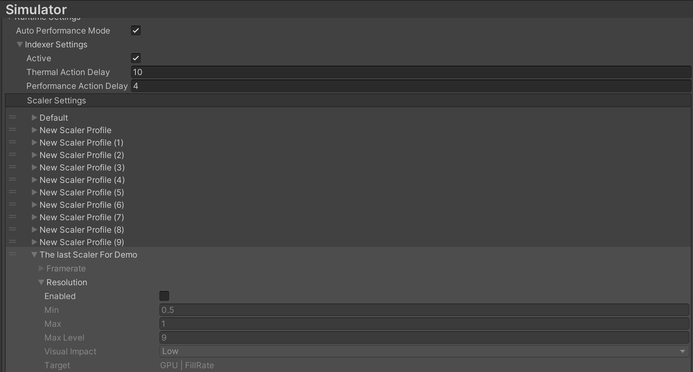

The scaler profiles UI will show the list of scaler profiles defined in the settings. You can click onto the name of a scaler and it will update all scalers defined in the profile.

# Technical details
## Requirements

Most samples are designed for Unity built-in render pipeline. Some samples require other Render Pipelines to showcase the features. Please see the [Universal Render Pipeline](#universal-render-pipeline) section below.

## Project Settings

To enable proper timing for Adaptive Performance, you need to enable the **Frame Timing Stats** option (menu: **Edit &gt; Project Settings &gt; Player &gt; Other Settings**).

If you want to use `Application.targetFrameRate` to limit the target frame rate, set the **VSync Count** option under **Edit &gt; Project Settings &gt; Quality &gt; Other** to **Don't Sync**.

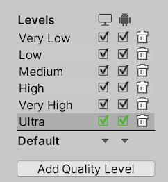

Unity has several quality levels in the quality settings. We recommend to switch the **VSync Count** to **Don't Sync** for each quality level. This will avoid issues with Adaptive Performance features like Adaptive Framerate and limiting the target framerate with `Application.targetFrameRate`.

### Optimized Frame Pacing

Adapitve Performance and Variable Refresh Rate is not compatible with framce pacing and we recommend to dissable **Optimized Frame Pacing** under **Edit &gt; Project Settings &gt; Player &gt; Resolution and Presentation**.

### Universal Render Pipeline
You need to use Universal Render Pipeline in your project for some samples. The Scalers used in those samples directly change settings in the Universal Render Pipeline and therefore will not have any effect when using any other Render Pipeline.

Adaptive Performance requires Universal Render Pipeline versions `7.5`, `8.2`, `10.0` and later. Install it via the [Unity Package Manager](https://docs.unity3d.com/Packages/com.unity.package-manager-ui@latest/index.html).

**Note:** In Universal Render Pipeline versions `7.5`, Adaptive Performance is disabled by default, you need to enable it in the Universal Render Pipeline Quality Asset.

To use the Universal Render Pipeline Settings we ship with the samples you have to follow following steps:

- Go to **Project Settings &gt; Graphics &gt; Scriptable Render Pipeline Settings** and add the Universal Render Pipeline Asset from `Environment/URP Settings/APSamplesHighQuality.asset`.
- Go to **Project Settings &gt; Quality &gt; Rendering** and add the Universal Render Pipeline Asset from `Environment/URP Settings/APSamplesHighQuality.asset`.
- Convert the Assets from Unity built-in pipeline to Universal Render Pipeline. Go to **Edit &gt; Render Pipeline &gt; Universal Render Pipeline &gt; Upgrade Project Materials to UniversalRP Materials** from Unity's main menu.
