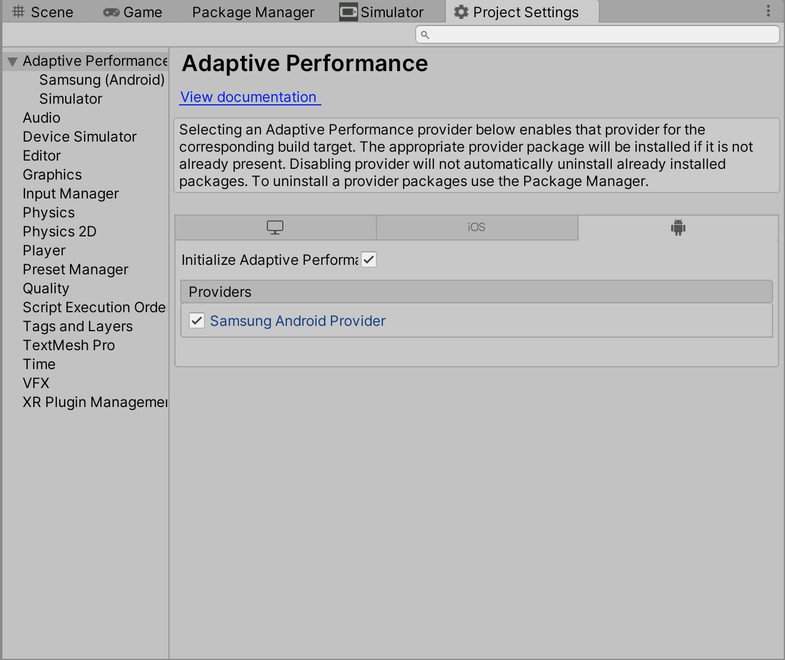
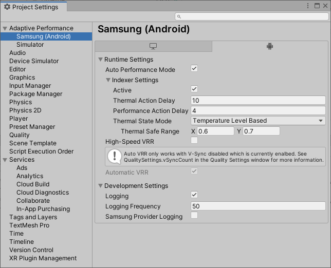
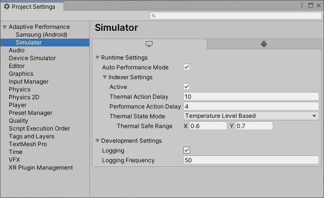

# Adaptive Performance user guide

When you install the Adaptive Performance package, Unity automatically creates a GameObject that implements `IAdaptivePerformance` in your Project at runtime. To access the instance, use `UnityEngine.AdaptivePerformance.Holder.Instance`.

To check if your device supports Adaptive Performance, use the `Instance.Active` property. To get detailed information during runtime, enable debug logging in the provider settings or via the `Instance.DevelopmentSettings.Logging` during runtime or via boot time flags from the settings API:

```csharp
static class AdaptivePerformanceConfig
{
    [RuntimeInitializeOnLoadMethod(RuntimeInitializeLoadType.AfterAssembliesLoaded)]
    static void Setup()
    {
        IAdaptivePerformanceSettings settings = AdaptivePerformanceGeneralSettings.Instance.Manager.activeLoader.GetSettings();
        settings.logging = true;
    }
}
```

Unity enables Adaptive Performance by default once you install the package and if it finds a suitable subsystem. A subsystem needs to be installed and enabled in the settings to be added at build time and discoverable during runtime. To disable Adaptive Performance, uncheck *Initialize Adaptive Performance on Startup* in the provider tab for the target platform.



For a description of the detailed startup behavior of a subsystem, see the [Subsystem Registration](https://docs.unity3d.com/Packages/com.unity.subsystemregistration@latest) documentation.

## Performance status

Adaptive Performance tracks several performance metrics and updates them every frame. To access these metrics, use the `Instance.PerformanceStatus` property.

### Frame timing

Adaptive Performance always tracks the average GPU, CPU, and overall frame times, and updates them every frame. To access the latest timing data, use the `PerformanceStatus.FrameTiming` property.

Overall frame time is the time difference between frames. Use it to calculate the current framerate of the application.

CPU time only includes the time the CPU is actually executing Unity's main thread and the render thread. It doesn’t include the times when Unity might be blocked by the operating system, or when Unity needs to wait for the GPU to catch up with rendering.

GPU time is the time the GPU is actively processing data to render a frame. It doesn’t include the time when the GPU has to wait for Unity to provide data to render.

### Performance bottleneck

Adaptive Performance uses the currently configured target frame rate (see [Application.targetFrameRate](https://docs.unity3d.com/ScriptReference/Application-targetFrameRate.html) and [QualitySettings](https://docs.unity3d.com/ScriptReference/QualitySettings.html)) and the information that `FrameTiming` provides to calculate what is limiting the application's frame rate. If the application isn’t performing at the desired target framerate, it might be bound by either CPU or GPU processing. To get a notification whenever the current performance bottleneck of the application changes, subscribe with a delegate function to the `PerformanceStatus.PerformanceBottleneckChangeEvent` event.

You can use the information about the current performance bottleneck to make targeted adjustments to the game content at runtime. For example, in a GPU-bound application, lowering the rendering resolution often improves the frame rate significantly, but the same change might not make a big difference for a CPU-bound application.

## Device thermal state feedback

The Adaptive Performance API gives you access to the current thermal warning level of the device (`Instance.ThermalStatus.ThermalMetrics.WarningLevel`) and a more detailed temperature level (`Instance.ThermalStatus.ThermalMetrics.TemperatureLevel`). The application can make modifications based on these values to avoid the operating system throttling it.

The following example shows the implementation of a Unity component that uses Adaptive Performance feedback to adjust the global LOD bias:

```
using UnityEngine;
using UnityEngine.AdaptivePerformance;

public class AdaptiveLOD : MonoBehaviour
{
    private IAdaptivePerformance ap = null;

    void Start() {
        ap = Holder.Instance;
        if (!ap.Active)
            return;

        QualitySettings.lodBias = 1.0f;
        ap.ThermalStatus.ThermalEvent += OnThermalEvent;
    }

    void OnThermalEvent(ThermalMetrics ev) {
        switch (ev.WarningLevel) {
            case WarningLevel.NoWarning:
                QualitySettings.lodBias = 1;
                break;
            case WarningLevel.ThrottlingImminent:
                if (ev.temperatureLevel > 0.8f)
                    QualitySettings.lodBias = 0.75f;
                else
                    QualitySettings.lodBias = 1.0f;
                break;
            case WarningLevel.Throttling:
                QualitySettings.lodBias = 0.5f;
                break;
        }
    }
}
```

## Configuring CPU and GPU performance levels

The CPU and GPU consume the most power on a mobile device, especially when running a game. Typically, the operating system decides which clock speeds to use for the CPU and GPU. CPU cores and GPUs are less efficient when running at their maximum clock speed. When they run at high clock speeds, the mobile device overheats, and the operating system throttles CPU and GPU frequency to cool down the device.

By default, Adaptive Performance automatically configures CPU and GPU performance levels based on the current performance bottleneck. Alternatively, you can switch to `Manual` mode; to do this, set  `Instance.DevicePerformanceControl.AutomaticPerformanceControl` to `false`. In `Manual` mode, you can change the `Instance.DevicePerformanceControl.CpuLevel` and `Instance.DevicePerformanceControl.GpuLevel` properties to optimize CPU and GPU performance. To check which mode your application currently runs in, use `Instance.DevicePerformanceControl.PerformanceControlMode`.

The application can configure these properties based on thermal feedback and frame time data that the Adaptive Performance API provides. It also uses these questions about its current performance requirements:

- Did the application reach the target frame rate in the previous frames?
- Is the application in a scene, a loading screen, or a menu?
- Are device temperatures rising?
- Is the device close to thermal throttling?
- Is the device GPU or CPU bound?

**Note:** Changing GPU and GPU levels only has an effect as long as the device is not in a thermal throttling state (`Instance.WarningLevel` equals `PerformanceWarningLevel.Throttling`).
In some situations, the device might take control over the CPU and GPU levels. This changes the value of `Instance.DevicePerformanceControl.PerformanceControlMode`
to `PerformanceControlMode.System`.

The following example shows how to reduce thermal pressure and power consumption by using the Adaptive Performance Automatic Performance Control. It adjusts the CPU and GPU levels based on your `targetFrameRate` and helps you to reduce power consumption heat efficiently. Setting CPU and GPU levels manually is not recommended for most cases. Instead, you should use the Automatic Performance Control to achieve the best performance by setting the `targetFrameRate` only:

```
public void EnterMenu()
{
    if (!ap.Active)
        return;

    Application.targetFrameRate = 30;
    // Enable automatic regulation of CPU and GPU level by Adaptive Performance
    var ctrl = ap.DevicePerformanceControl;
    ctrl.AutomaticPerformanceControl = true;
}

public void EnterBenchmark()
{
    var ctrl = ap.DevicePerformanceControl;
    // Set higher CPU and GPU level when benchmarking a level
    ctrl.cpuLevel = ctrl.MaxCpuPerformanceLevel;
    ctrl.gpuLevel = ctrl.MaxGpuPerformanceLevel;
}
```

## Indexer and Scalers

The Indexer is an Adaptive Performance system that tracks thermal and performance state and offers a quantified quality index.

Scalers are components that represent individual features, such as graphics or physics. A Scaler controls the quality of its feature, using data from the indexer to make adjustments. A Scaler's default value is zero. As the value increases, the associated feature's quality (as measured by level of detail) decreases.

Scalers make decisions based on priorities that the Indexer supplies, using the following targets:

- Targets current bottleneck.
- Lowest level.
- Lowest visual impact.

Scalers only work when the Indexer is active. Activate the Indexer from the **Project Settings** window (menu: **Edit &gt; Project Settings &gt; Adaptive Performance &gt; {Provider} &gt; Runtime Settings &gt; Indexer Settings**, then enable the **Active** option).



Add any Scaler into the scene which you want to control using the Indexer quality quantification.

### Standard Scalers

Adaptive Performance provides a few common Scaler.

General render Scalers:
- AdaptiveLOD
- AdaptiveResolution
- AdaptiveFramerate

Universal Render Pipeline Scalers (These Scalers only work with `com.unity.render-pipelines.universal`, versions `7.5`, `8.2`, and `10.0`):
- AdaptiveBatching
- AdaptiveLUT
- AdaptiveMSAA
- AdaptiveShadowCascade
- AdaptiveShadowDistance
- AdaptiveShadowQuality
- AdaptiveShadowmapResolution
- AdaptiveSorting
- AdaptiveTransparency

See the [Adaptive Performance samples](samples-guide.md) for more information about Scalers.

### Custom Scalers

To create custom Scalers, you need to create a new class that inherits from `AdaptivePerformanceScaler`.

The following example shows a Scaler for controlling texture quality:

```
public class TextureQualityScaler : AdaptivePerformanceScaler
{
   public override ScalerVisualImpact VisualImpact => ScalerVisualImpact.High;
   public override ScalerTarget Target => ScalerTarget.GPU;
   public override int MaxLevel => 2;

   int m_DefaultTextureQuality;

   protected override void OnDisabled()
   {
       QualitySettings.masterTextureLimit = m_DefaultTextureQuality;
   }

   protected override void OnEnabled()
   {
       m_DefaultTextureQuality = QualitySettings.masterTextureLimit;
   }

   protected override void OnLevel()
   {
      switch (CurrentLevel)
      {
         case 0:
            QualitySettings.masterTextureLimit = 0;
            break;
         case 1:
            QualitySettings.masterTextureLimit = 1;
            break;
         case 2:
            QualitySettings.masterTextureLimit = 2;
            break;
      }
   }
}
```

## Provider settings



Each Adaptive Performance provider supplies several settings for controlling behavior at runtime and during development. The following settings are available for all providers, but values are provider-specific.

### Auto Performance Mode
Auto Performance Mode controls performance by changing CPU and GPU levels automatically to provide the best performance and preserve battery at the same time.

### Indexer
- Active: Whether or not the Indexer system should be enabled.
- Thermal Action Delay: Delay in seconds after any scaler is applied or unapplied because of thermal state.
- Performance Action Delay: Delay in seconds after any scaler is applied or unapplied because of performance state.

### Scaler
Every Scaler shares a set of settings which describe the cost of the Scaler. The higher the cost, the more often the Indexer will increase a level for the Scaler. Changing the level triggers a quality change in the Scaler. Following settings are available for every Scaler.

|**Setting**|**Description**|
|:---|:---|
|Enabled| Defines if a scaler is enabled or disable. You can change this setting during runtime. |
|Visual Impact| The visual impact can be high, medium or low and depends on how much visual change a quality settings change causes. The higher the visual impact the higher the cost. this means a Scaler level is increased more often than a level of a Scaler with a lower cost.  You can change this setting during runtime. |
|Target| This setting can not be changed. It defines which [bottleneck](#performance-bottleneck) a Scaler targets. Those targets can be CPU, GPU or Fillrate. If a bottleneck algins with the target of a scaler it triggers the highest cost for this Scaler and the level is often increase. |

The target of a Scaler corresponds to a [performance bottleneck](#performance-bottleneck).

|**Target**|**Bottleneck**|
|:---|:---|
|CPU| CPU bound |
|GPU| GPU bound |
|Fillrate| Target Frame Rate bound |

Following Scaler have additional settings

#### Adaptive Framerate
Adaptive Framerate requires a minimum and maximum framerate. The Scaler sets the Application.targetFrameRate to a suitable value inbetween those values.

|**Setting**|**Description**|
|:---|:---|
|Minimum | Defines the lowest framerate acceptable.|
|Maximum | Defines the highest framerate the Scaler should target. |

#### Adaptive Resolution
Adaptive Resolution requires a minimum and maximum boundary. The Scaler changes the resolution inbetween those boundaries in steps defined by the maximum level.

|**Setting**|**Description**|
|:---|:---|
|Minimum Boundary | Defines the lowest scale acceptable.|
|Maximum Boundary | Defines the highest scale desireable.|
|Maximum Level | Defines the scale steps which are taken between minimum and maximum boundary.|

### Development Settings
 - Logging: Enable this option to have the Adaptive Performance subsystem log messages to the player log. This is only active for Development builds.
 - Logging Frequency: How frequently the system should log messages. Specified in frames.
