# Adaptive Performance Visual Scripting

After installing Adaptive Performance, Unity's [Visual Scripting](https://docs.unity3d.com/2021.2/Documentation/Manual/com.unity.visualscripting.html) system includes [nodes](https://docs.unity3d.com/Packages/com.unity.visualscripting@latest/index.html?subfolder=/manual/vs-nodes.html) that you can use to access Adaptive Performance metrics without implementing anything in C#.

When you install the Visual Scripting package, Unity automatically activates the Adaptive Performance units. When you add Adaptive Performance to a project with existing Visual Scripting graphs, you must recompile the units. To do this, select **Edit** &gt; **Project Settings** &gt; **Visual Scripting** &gt; **Node Library** &gt; **Regenerate Units**.

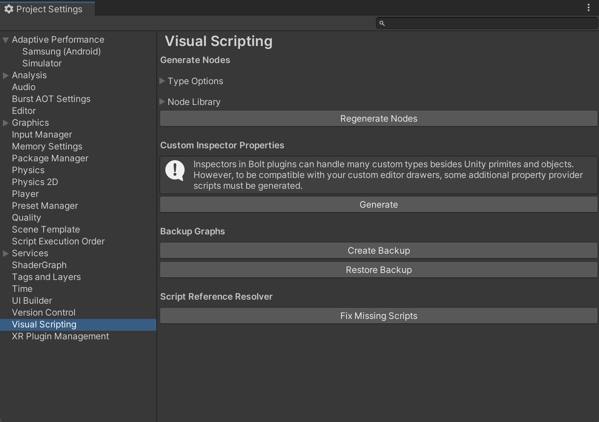

After Unity regenerates Adaptive Performance units, you can add new units in your graph. To do this, right-click on the background of any script graph. You can find the units in the Adaptive Performance sub-menu.

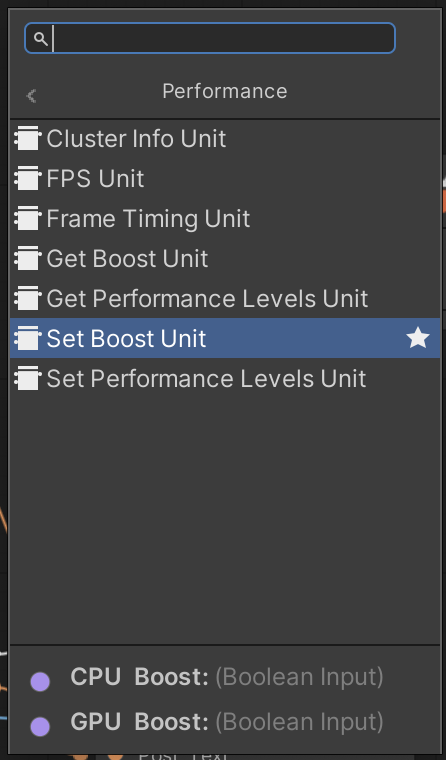

## Units

This section contains information on the Adaptive Performance-related units.

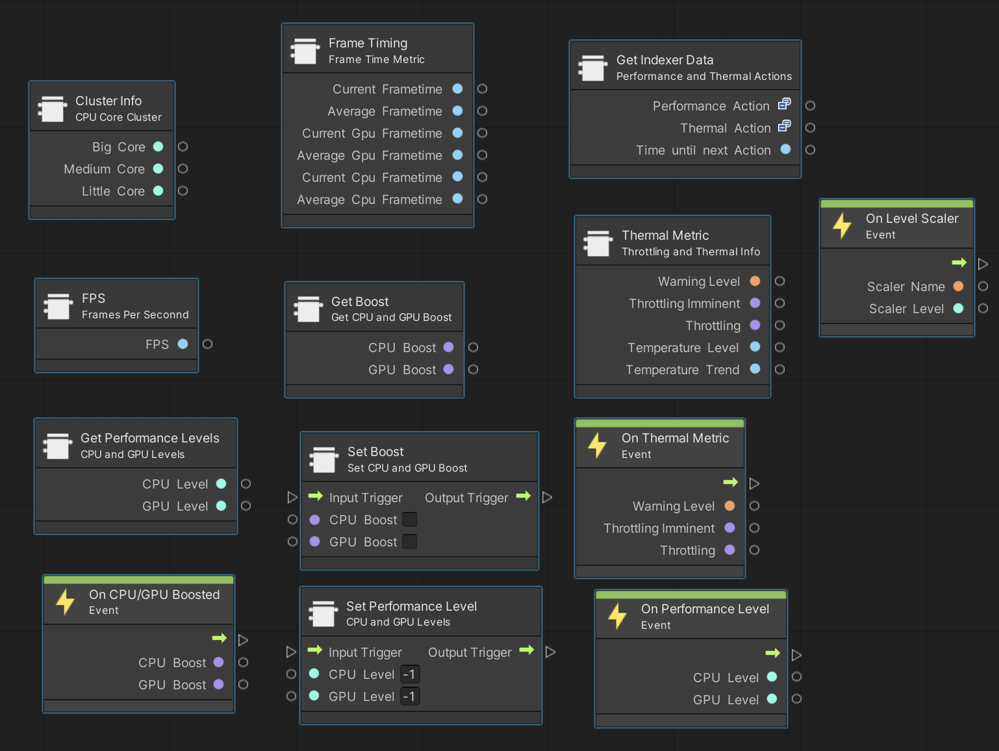

After you install Adaptive Performance, the **Visual Scripting Fuzzy finder** displays the following additional units:

### Thermal

You can find the thermal nodes in the fuzzy search under AdaptivePerformance/Thermal.

Use the On Thermal Metric event unit to receive updates when the thermal warning levels change.

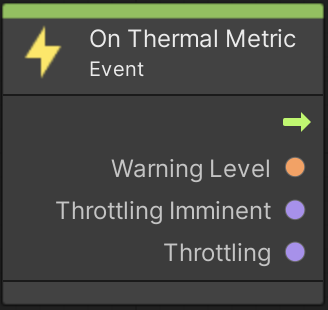

For read-only properties, the Thermal Metric unit includes the temperature level and trend as well as the warning levels.

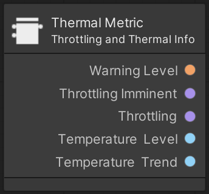

For more information on thermals, refer to [device-thermal-state-feedback](user-guide.md#device-thermal-state-feedback).

### Performance

You can find all available performance units in the fuzzy search under AdaptivePerformance/Performance.

#### Bottleneck

Use the On Bottleneck event unit to receive updates when the state of a bottleneck changes.

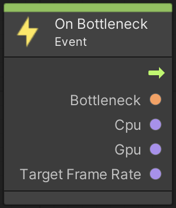

For more information on the bottleneck feature, refer to the [user guide](user-guide.md#performance-bottleneck).

#### Frametiming

The Frame Timing unit provides different frametime metrics.

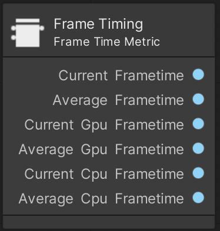

For more information, refer to [frametimings](user-guide.md#frame-timing).

##### FPS

The FPS (Frames per Second) items provide an accurate representation of how many frames are rendered per second.

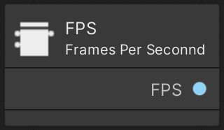

#### Clusterinfo

The Cluster Info unit provides information about CPU cores.

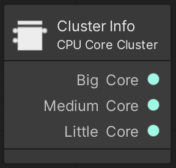

For more information about the Cluster Info feature, refer to the [user guide](user-guide.md#cluster-info).

#### Performance Levels

Use the On Performance Level event unit to receive updates when CPU or GPU levels change.

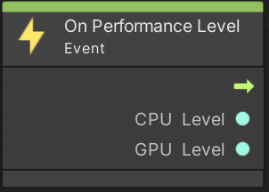

To actively change performance levels use the Set Performance Level unit.

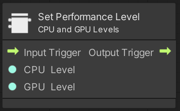

To see the current CPU and GPU performance levels use the Get Performance Level unit.

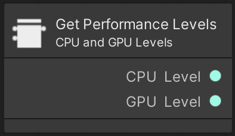

For more information, refer the [user guide](user-guide.md#configuring-cpu-and-gpu-performance-levels).

#### Performance Mode

Use the On Performance Mode event unit to receive updates when the performance mode changes.

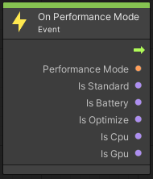

To see the current performance mode, use the Get Performance Mode unit.

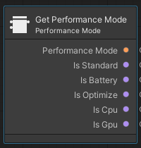

For more information about performance mode, refer to the [user guide](user-guide.md#performance-mode-status).

#### Boost

Use the On Boost event unit to receive updates when the CPU or GPU boost starts or ends.

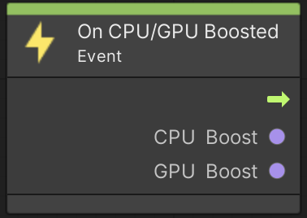

To activate the CPU or GPU boost use the Set Boost unit.

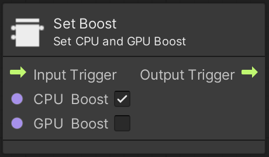

To see the current status of the CPU or GPU boost, use the Get Boost unit.

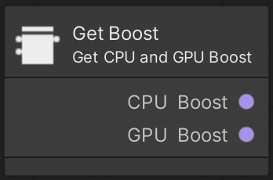

For more information, refer to the [boost mode](user-guide.md#boost-mode).

### Indexer and Scalers

To view the current thermal or performance action or when the next evaluation happens, use the Get Indexer Data unit.

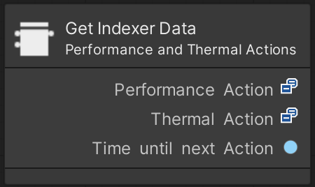

Use the On Level Scaler event unit to receive updates when and to which level a scaler changes.

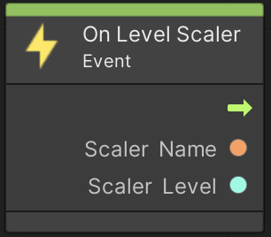

For more information about the individual scalers, refer to [indexer-and-scalers](user-guide.md#indexer-and-scalers).
